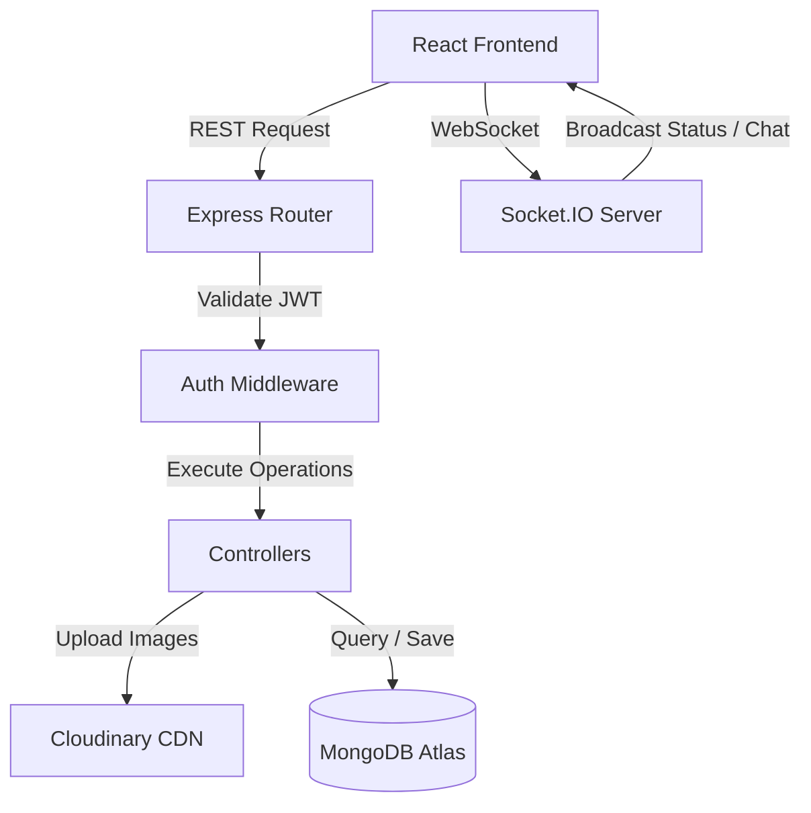

# ConnectSphere – Real-Time MERN Chat Application

ConnectSphere is a full-stack real-time messaging application built with the MERN stack (MongoDB, Express, React, Node.js), featuring immediate messaging pipelines via Socket.IO, profile and message image attachments powered by Multer and Cloudinary, and immersive interactive 3D components rendered through React Three Fiber.

Designed as an industry-standard, portfolio-ready project, this application showcases modern web practices, including stateless JWT authorization, real-time presence, typing states, message read receipts, date partitioning, message deletion, and fully responsive glassmorphic interfaces.

---

## Table of Contents
1. [Key Features](#key-features)
2. [Technologies Used](#technologies-used)
3. [System Architecture](#system-architecture)
   - [Database Logic & Schema Design](#1-database-logic--schema-design)
   - [Authentication & Security Flow](#2-authentication--security-flow)
   - [Socket.IO Event Flow](#3-socketio-event-flow)
   - [Image Upload Mechanism](#4-image-upload-mechanism)
4. [Folder Structure](#folder-structure)
5. [Installation & Local Setup](#installation--local-setup)
6. [Environment Variables](#environment-variables)
7. [API Endpoints Reference](#api-endpoints-reference)
8. [Protecting Sensitive Information (Security)](#protecting-sensitive-information-security)
9. [Deployment Guide](#deployment-guide)
10. [Learning Notes & Future Improvements](#learning-notes--future-improvements)

---

## Key Features
- **3D Animated Splash Screen**: Fluid welcome page powered by Framer Motion and an animated, distorting 3D Logo Bubble Canvas background.
- **Interactive 3D Home Hero**: Dynamic, rotating globe surrounded by floating particles and network paths that react to hover controls.
- **Real-Time 1-to-1 Chat**: Low-latency message delivery using WebSockets (Socket.IO).
- **Online Presence Tracking**: Global user tracking showing active states and "last seen" counters.
- **Typing Indicator**: Instant notification displaying "User is typing..." when your partner is inputting text.
- **Double-Tick Read Receipts**: Real-time read indicators that transition from single ticks (sent) to double ticks (delivered) to blue checkmarks (read) as soon as messages are read.
- **Image Sharing**: Preview selected photos locally before transmitting them via Multer to Cloudinary.
- **Delete for Self**: Discards messages from your history while retaining them in the partner's database view.
- **Synthesized Audio Notifications**: In-app sound chimes constructed using the browser's Web Audio API (no external asset dependencies needed).
- **Full Emoji Support**: Inline interactive picker for insertion.
- **Glassmorphic Responsive Design**: Clean dark-mode palette styled with Tailwind CSS, adapted for mobile and desktop screens.

---

## Technologies Used

### Frontend
- **React.js (Vite)**: Component-driven web interface.
- **React Router DOM**: Client-side application routing.
- **Tailwind CSS**: Layout design system.
- **Three.js & React Three Fiber (R3F)**: Declarative 3D scene builder.
- **@react-three/drei**: Useful helper objects (such as OrbitControls and MeshDistortionMaterial).
- **Framer Motion**: State transition page animations.
- **Axios**: Promised-based HTTP request handler.
- **Socket.IO Client**: WebSocket connection gateway.
- **Lucide React**: Clean vector iconography.

### Backend
- **Node.js & Express.js**: High-performance RESTful API structure.
- **MongoDB Atlas & Mongoose**: Object Data Modeling (ODM) database setup.
- **Socket.IO**: Real-time duplex communication server.
- **JWT (JsonWebToken)**: Secure, stateless token authorization.
- **Bcrypt.js**: Pre-save cryptographic hashing for passwords.
- **Multer**: Multi-part form-data parser for file uploads.
- **Cloudinary SDK**: Cloud-based media storage hosting.

---

## System Architecture



### 1. Database Logic & Schema Design
Mongoose manages three models representing data structures:

*   **User Schema**:
    *   `name` & `email`: Trinned text. Emails enforce uniqueness with regex checking.
    *   `password`: Cryptographically hashed using bcrypt, flagged with `select: false` so that standard user queries do not leak hashes.
    *   `avatar` & `bio`: Profile defaults.
    *   `onlineStatus` & `lastSeen`: Track status flags.

*   **Chat (Conversation) Schema**:
    *   `participants`: Array of two MongoDB ObjectIds referencing the `User` collection.
    *   `lastMessage`: Points to the most recent `Message` document to render previews.
    *   *Optimizations*: Indexed on `participants` to enable immediate retrieval of active dialogues.

*   **Message Schema**:
    *   `chatId`: Refers to the parent conversation room.
    *   `sender` & `receiver`: Reference user IDs.
    *   `message` & `image`: Payload elements.
    *   `status`: Tracked as `sent`, `delivered`, or `read`.
    *   `deletedBy`: Array of user IDs who executed "delete for self". Messages are filtered out of the API query if the active user's ID is present here.

---

### 2. Authentication & Security Flow
1.  **Registration**: Accepts name, email, password, and optionally a profile picture file.
    *   Email duplication checks are ran initially.
    *   A pre-save Mongoose hook generates a salt and encrypts the password using `bcryptjs`.
2.  **Login**: Matches credentials. If validated, returns user details along with a JWT token containing the user's ID signed by the server's `JWT_SECRET`.
3.  **Authorization**: Secure client-side requests append the token in the `Authorization: Bearer <JWT>` header. The `protect` middleware decodes this header, confirms token validity, and appends the user's model details to the Express `req.user` context.

---

### 3. Socket.IO Event Flow
When users authenticate, the client initializes a socket connection, passing the `userId` in the handshake query.

*   **Connection & Presence**: The socket server maps the `userId` to its active `socket.id`. It marks the user as online in the database and broadcasts `userStatusChange: online` to all connected clients.
*   **Real-time Delivery**: When a message is sent via Express, the controller accesses the `req.io` socket handle. It locates the receiver's socket ID in the server map and sends the message directly using `io.to(socketId).emit('newMessage', msg)`.
*   **Typing States**: When input changes, the client fires a `typing` event. The server routes it to the partner's active socket, triggering "User is typing..." on their screen. A 1.5-second debounce timeout halts typing states if keyboard inputs cease.
*   **Read Receipts**: When a user selects a chat, the client requests messages and triggers `readMessages` via sockets. The server updates the message status to `read` in the database, and emits `messagesRead` to the sender's client, turning double ticks blue.

---

### 4. Image Upload Mechanism
1.  **Selection**: The user selects a file (avatar or chat media). The client creates a local blob preview using `URL.createObjectURL(file)`.
2.  **Transmission**: Form data is sent via Axios to Express.
3.  **Multer Parsing**: The `upload` middleware intercepts the request, validates file limits (5MB) and file formats (jpg/png/webp), and writes the file to a local temp folder (`/uploads`).
4.  **Cloudinary Dispatch**: The controller triggers the Cloudinary SDK, uploading the file from local storage to the secure Cloudinary CDN.
5.  **Cleanup**: The local temp file is deleted synchronously (`fs.unlinkSync`) whether the upload succeeds or fails, preventing server disk bloat. The Cloudinary URL is saved to the MongoDB document.

---

## Folder Structure

The project is structured with a distinct separation between backend and frontend code:

```
connectsphere/
├── backend/
│   ├── config/          # MongoDB & Cloudinary SDK configs
│   ├── controllers/     # Route logic (Auth, Chat, Message)
│   ├── middleware/      # Auth validation, upload processing, errors
│   ├── models/          # Mongoose Schemas (User, Chat, Message)
│   ├── routes/          # Express API route endpoints
│   ├── sockets/         # Socket.IO connection event gateway
│   ├── uploads/         # Local temp directory (ignored from Git)
│   ├── .env.example     # Template variables instructions
│   └── server.js        # Main Express/Socket.IO bootstrap
├── frontend/
│   ├── public/          # Static browser assets
│   ├── src/
│   │   ├── components/  # Core components (Sidebar, ChatArea)
│   │   │   └── 3d/      # R3F Mesh elements (GlobeNetwork, LogoBubble)
│   │   ├── context/     # Global state contexts (Auth, Socket, Chat)
│   │   ├── hooks/       # Utility hooks
│   │   ├── pages/       # Main views (SplashScreen, Login, Home, Profile)
│   │   ├── services/    # Axios HTTP client API mappings
│   │   ├── index.css    # Global stylesheet and Tailwind directives
│   │   └── main.jsx     # Root React render file
│   └── tailwind.config.js
└── .gitignore           # Global git ignore configuration
```

---

## Installation & Local Setup

### Prerequisites
- [Node.js](https://nodejs.org/) (v16 or higher)
- [MongoDB Atlas Account](https://www.mongodb.com/cloud/atlas) (or local MongoDB community instance)
- [Cloudinary Account](https://cloudinary.com/) (free tier is perfect)

### Steps

1.  **Clone the Repository**:
    ```bash
    git clone https://github.com/yourusername/connectsphere.git
    cd connectsphere
    ```

2.  **Set Up the Backend**:
    ```bash
    cd backend
    npm install
    ```
    *   Create a `.env` file inside `backend/` and add your credentials (see [Environment Variables](#environment-variables)).

3.  **Set Up the Frontend**:
    ```bash
    cd ../frontend
    npm install
    ```

4.  **Run Locally**:
    *   **Start the Backend Dev Server (runs on Port 5000)**:
        ```bash
        cd backend
        npm run dev
        ```
    *   **Start the Frontend Dev Server (runs on Port 5173)**:
        ```bash
        cd frontend
        npm run dev
        ```
    *   Open `http://localhost:5173` in your browser.

---

## Environment Variables

### Backend (`backend/.env`)
Create a file named `.env` inside the `backend/` folder and populate it with the following:
```env
PORT=5000
MONGODB_URI=mongodb+srv://<username>:<password>@cluster.mongodb.net/connectsphere?retryWrites=true&w=majority
JWT_SECRET=generate_a_secure_long_random_string_here
CLIENT_URL=http://localhost:5173

# Cloudinary Setup
CLOUDINARY_CLOUD_NAME=your_cloudinary_cloud_name
CLOUDINARY_API_KEY=your_cloudinary_api_key
CLOUDINARY_API_SECRET=your_cloudinary_api_secret
```

---

## API Endpoints Reference

### Authentication Routes (`/api/auth`)
*   `POST /register` - Register new user (Supports single-file upload with field name `avatar`).
*   `POST /login` - Login with credentials, returns user details + JWT.
*   `GET /me` - Fetches authenticated user info (Protected).
*   `PUT /profile` - Updates display name/bio/avatar (Protected, avatar field name `avatar`).
*   `POST /logout` - Flags user offline (Protected).

### Chat Routes (`/api/chats`)
*   `GET /` - Fetches all active conversation threads for the user (Protected).
*   `POST /` - Starts or retrieves a 1-to-1 conversation with `userId` (Protected).
*   `GET /users` - Search and discover other users via query `?search=keyword` (Protected).

### Message Routes (`/api/messages`)
*   `GET /:chatId` - Loads all message history for a specific chat (Protected).
*   `POST /` - Sends a message with text and/or file image (Protected, image field name `image`).
*   `DELETE /:messageId` - Deletes a message for self (Protected).

---

## Protecting Sensitive Information (Security)

> [!CAUTION]
> **Protecting Secrets in Repositories**:
> Never commit configuration `.env` files containing actual passwords, MongoDB Atlas URIs, Cloudinary API secrets, or JWT tokens to public platforms like GitHub.
> Doing so exposes your database to brute-force queries, data manipulation, and credentials theft.
>
> **Enforced Protections**:
> - We utilize the global `.gitignore` and folder-specific `.gitignore` configurations to explicitly prevent pushing files like `.env`, `.env.local`, `node_modules/`, and uploads folders to remote repositories.
> - Use the provided `.env.example` templates to convey project requirements to other developers safely.

---

## Deployment Guide

### Backend (deployed on Render, Railway, or Heroku)
1.  Set up a Web Service linked to your Git repository.
2.  Set the base directory/working directory to `backend`.
3.  Configure Build Command: `npm install`
4.  Configure Start Command: `node server.js`
5.  In the dashboard's "Environment Variables" section, add all keys listed in your `.env` (MongoDB, JWT, Cloudinary details, etc.) and map `CLIENT_URL` to your production frontend URL.

### Frontend (deployed on Vercel or Netlify)
1.  Connect your repository to the deployment platform.
2.  Set Build command: `npm run build`
3.  Set Output Directory: `dist`
4.  Set Environment Variables:
    *   `VITE_API_URL` -> Set to your deployed backend URL + `/api` (e.g. `https://connectsphere-api.onrender.com/api`).
    *   `VITE_SOCKET_URL` -> Set to your deployed backend URL (e.g. `https://connectsphere-api.onrender.com`).

---

## Learning Notes & Future Improvements

### Sockets Decoupling
Integrating Socket.IO with Express controllers by injecting the `io` instance into `req.io` is a highly scalable pattern. It separates socket listeners from standard API controller endpoints, making code structures modular and easy to unit test.

### Web Audio Synthesis
Constructing notification alarms by dynamically generating sine waves on the browser's `AudioContext` prevents the need to ship separate audio asset files (which are often prone to 404 network failure or cross-origin issues).

### Potential Scale Upgrades
- **Group Chats**: Extend schemas to allow multi-user participants.
- **Message Read Receipts**: Add detailed recipient delivery tables (e.g., delivered/read timestamps for group chats).
- **Message Reactions**: Attach an array of small emoji tags to message models.
